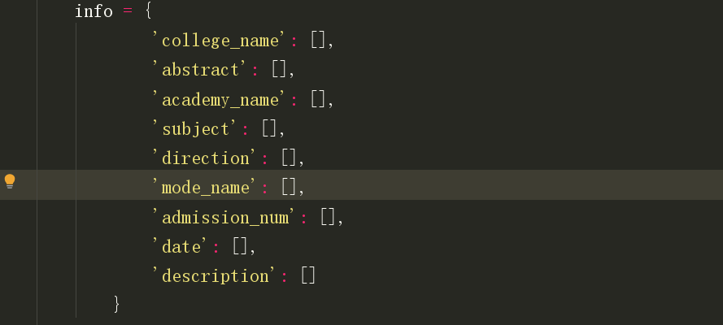
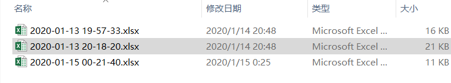
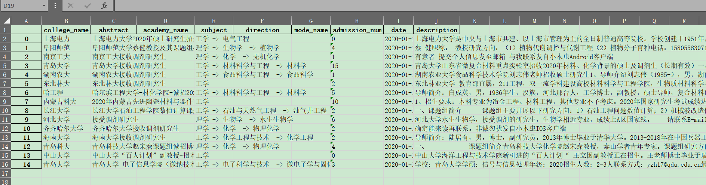
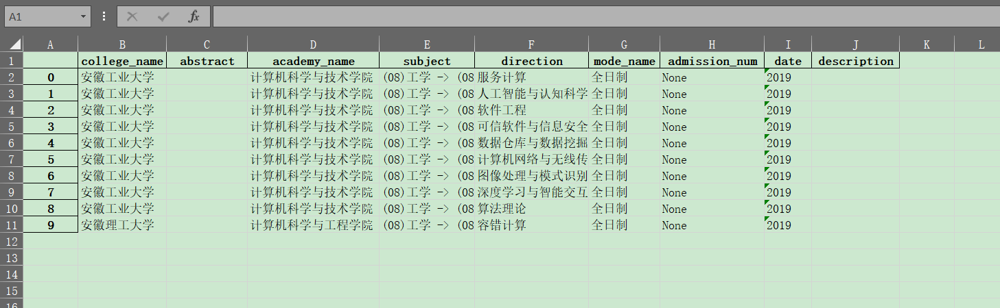

## 各种调剂信息网站的爬虫接口

**1. [木虫论坛](#木虫论坛)**

**2. [研鹿网（考研村）](#研鹿网)**

**3. [Demo](#Demo)**

<hr>

### 接口的形式：



为了扩展，我将**所有网站的数据都组织为同一种形式**，见上图

另外，**接口获取的数据可直接转为 pandas 的 DataFarme**，如：

```
import pandas as pd

import src.mc.config as mc_config

mc = MC(mc_config.index_payload)
info =  mc.mc_interface(1) # 参数为页码
df = pd.DataFrame(info)

'''
对 df 进行任意操作
'''
df.to_excel("mc.xlsx")
```

**因此，获取到的数据你无需任何处理**，就可以用于**数据分析、爬虫等等**

### 木虫论坛

这个网站本身很简单，但为了扩展需要，把木虫的调剂接口参数全搞出来了。

详细的请查看 **config.py**  中的配置信息（大部分是不需要的，必要的部分我已经说明了）


关于爬虫，我已经写成了接口的形式，用名为 MC 的类封装起来

函数使用参见注释和例子


各位可以基于这个接口定制一些东西，比如

- config 中的特别详细的参数列表，是为了扩展为 GUI 的需要；
- 另外，推荐基于 python 的 **apscheduler** 库实现调剂信息自动下载，如**[Demo](../dispensing/src/demo/)**

### 研鹿网

这个网站很唬人，我也写成了接口的形式

<hr>

### Demo

我实现了一个小 [demo](./src/demo/)

**使用：**

```
pip install -r requirements.txt
cd src/demo
python demo.py
```

**存储结果（一页）：**



<hr>
**木虫**：



**研鹿**：


