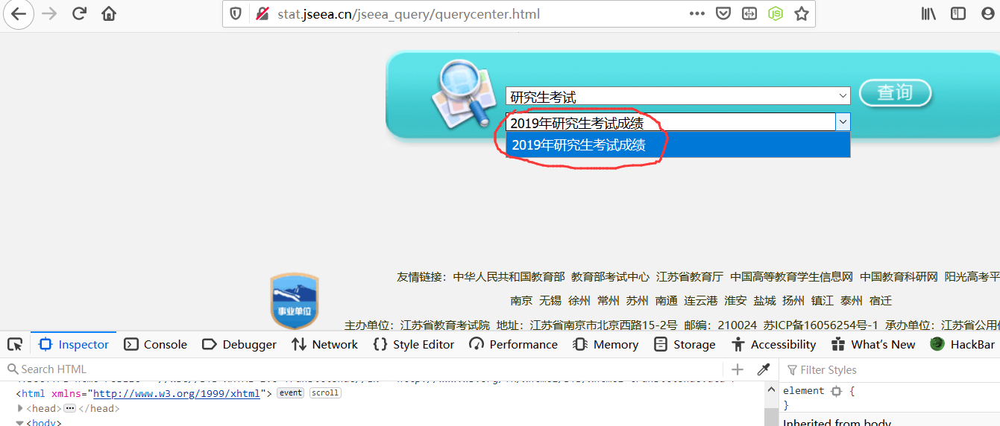

简介
------

此接口为监测某些高校或省份是否提前出分提供了解决方案，目前已支持的高校及省份有：

1. [四川大学](#四川大学)
2. [江苏省教育考试院](#江苏省教育考试院)

提前查分的可行性
------

举个例子

**首先：**

​	成绩数据一般是先在教育局的数据库中，假如四川大学通知 11 号可以查分，那么教育局一定会提前一段时间将数据库接口开放给四川大学

**其次：**

​	在一般情况下，川大拿到接口之后一定要对查询分数的接口进行测试，这样做是为了确保查分流程不受影响不出错，这就是成绩在提前一天左右到二天有可能提前查到的原因

**不过：**

​	至于能否查到，完全看脸，所以也没必要将希望寄托在这个上面，早一天晚一天差距并不大，最多可以装个b

提前查分监测的原理
------

出分的前两天有可能会提前开放接口用于测试，如果我们**一直请求这个接口，那么就可能可以提前知晓查分接口是否开放**，那时我们就可以去查分的网页查分

接口的使用方法
------

如果没有特殊的定制需要（有定制需要滑到最下面），只需进行如下步骤

#### 修改配置文件 （src/Config.py）：

1. 通用配置：

   ```python
   ### 以下为通用的配置，需自己配置
   
   send_email_account = "发件邮箱账户" # 用于发送出分通知的邮箱账户和密码
   send_email_password = "发件邮箱密码" # 请使用 outlook 等无需进行 SMPTP 或 POP3 授权的邮箱
   receive_email_account = "收件邮箱" # 如果出分了则发送电子邮件给这个账户
   email = {
   	'subject': '出分了！', # 邮件标题
   	'content_text': '', # 邮件内容，无需更改
   }
   
   ```

2. 四川大学：

   ```python
    1. 四川大学配置
   scu_config = {
   	'id_num': '',  # 身份证号
   	'name': ''.encode('utf-8'),  # 名字
   	'v_code': 'L626',  # 随便填一个四位的字母和数字，无需更改
   	'c_num': '',  # 考号 15 位
   }
   
   ```

3. 江苏省高校：无

#### 修改及运行 main

**修改**

1. 四川大学：

   ```python
   from gre.src.Score import SCU
   from gre.src.Utils import emailNotify, randomSleep
   
   if __name__ == '__main__':
      scu = SCU()
      while randomSleep(time_seed=2):
         result = scu.check()
         if result:
            emailNotify(result)
         randomSleep(time_seed=2)
   ```

2. 江苏省高校：

   ```
   from gre.src.Score import JSEEA
   from gre.src.Utils import emailNotify, randomSleep
   
   if __name__ == '__main__':
      jseea = JSEEA()
      while randomSleep(time_seed=2):
         result = jseea.check()
         if result:
            emailNotify(result)
         randomSleep(time_seed=2)
   ```

**运行**: 想要 24 小时不间断监测需要一台云服务器

1. 安装 python3 和 git

2. 然后依次运行以下代码即可：

   ```
   git clone https://github.com/1uvu/zapis.git
   cd zapis/gre/
   pip3 install -r requirements.txt
   python3 main.py
   ```

下面单独介绍每个接口的简单原理及使用

四川大学
------

#### 原理

**利用验证码错误的响应，判断查分接口是否开启**

川大的查分网页为纯静态网页，且“机智地”将查询按钮设置成 **disabled**，按下图所示删去这一行代码时可以跳过这一限制

_RMBPQT996.png)

当尝试查分时（即便验证码故意输入错误）结果返回：**不在可查询时间范围内**

猜测，在后端校验了时间

所以，判断查分接口是否开启的思路就很简单了：

1. 如果接口开启，我输入错误的验证码，结果应该返回的是：验证码错误
2. 那么反过来说，如果我在一次查询时结果返回了：验证码错误，那么接口是不是就是开启了？

对，就是这么简单，虽然他的验证码可以通过图片识别破解，但是没必要，因为我们的目的**并不是通过程序查分，而是通过程序监测是不是可以查了**

#### 使用

1. 按照上文设置好配置及代码，在一个可以 24 小时运行的服务器运行此代码
2. 当收到**可以查分**的邮件请立即**使用 PC 浏览器**前往官网查分
3. 按照上图所示，删去 **disabled**，即可在网页上查分

江苏省教育考试院
------

#### 原理：

**利用查询列表的更新状态，判断查分接口是否开启**

江苏考试院的查分网页聚合了多个分数数据库，我们需要手动选择研究生入学考试才可以，如图




可以看到，只出现了 19 年一年的数据库，所以思路就很简单了

如果可以查询 20 年的分数了，那么此页面只会显示 20 年的数据库，也就是说：**”2019年研究生入学考试“这几个字没有了**

这个好像比上一个的还简单


如何定制
------

#### 自行添加支持院校

1. 在配置文件（src/Config.py）中特定区域放置配置规则
2. 在 Score 类中添加院校的子类，关于 Utils 中的工具函数见代码注释
3. 在 main 函数中运行你的代码

#### 修改运行逻辑

1. 在 Score 类中添加院校的子类在 init 中初始化，且只有一个 check 函数用于检查是否可查分
2. Utils 中的 emailNotify 函数用于发送邮件，randomSleep 函数为随机睡眠防止封 IP（众所周知，对付教育网站的反爬，这点手段已经足够了）

其他推荐
------

出分之后考得不理想怎么办？

**调剂啊！**

调剂信息去哪找？

**不用找了，我这都有！**


**集合了各大调剂信息平台的信息接口，只需几行代码即可获取最新调剂信息**

**代码请移步[各种调剂信息网站的爬虫接口](../dispensing/)**